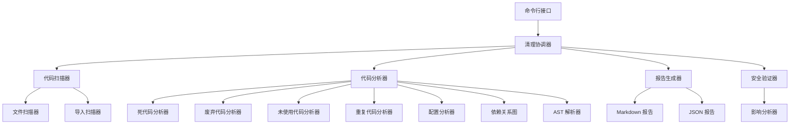

# 代码清理系统设计文档

## 概述

本文档描述了 UE Toolkit 项目代码清理系统的详细设计。该系统旨在自动化识别和清理无用代码、死代码、废弃代码和未使用文件，确保代码库的整洁性和可维护性。

系统采用模块化设计，支持增量清理、安全验证和详细报告生成，确保清理过程可控且可追溯。

## 架构

### 系统架构图



### 核心组件

#### 1. 清理协调器 (CleanupOrchestrator)

负责协调整个清理流程，管理各个分析器的执行顺序和结果汇总。

**职责**:

- 初始化所有分析器
- 按顺序执行分析任务
- 汇总分析结果
- 触发报告生成
- 管理清理进度

#### 2. 代码扫描器 (CodeScanner)

负责扫描项目文件系统，构建文件列表和基础信息。

**职责**:

- 扫描所有 Python 文件
- 扫描配置文件（JSON、INI 等）
- 扫描资源文件（QSS、图标等）
- 过滤排除目录（如 .git、**pycache** 等）
- 构建文件索引

#### 3. AST 解析器 (ASTParser)

使用 Python 的 `ast` 模块解析代码，提取语法树信息。

**职责**:

- 解析 Python 源代码为 AST
- 提取函数定义
- 提取类定义
- 提取导入语句
- 提取变量赋值
- 缓存解析结果

#### 4. 依赖关系图 (DependencyGraph)

构建模块间的依赖关系图，用于分析代码引用。

**职责**:

- 构建模块导入关系
- 构建函数调用关系
- 构建类继承关系
- 提供可达性分析
- 检测循环依赖

#### 5. 分析器集合

##### 5.1 死代码分析器 (DeadCodeAnalyzer)

识别永远不会被执行的代码。

**检测规则**:

- `return` 后的语句
- `raise` 后的语句
- `break`/`continue` 后的语句
- 永远为 False 的条件分支
- 未被调用的私有函数（以 `_` 开头）
- 未被实例化的类

##### 5.2 废弃代码分析器 (DeprecatedAnalyzer)

识别标记为废弃的代码。

**检测规则**:

- `@deprecated` 装饰器
- 注释中包含 "deprecated"、"废弃"、"已弃用"
- 检查废弃代码的引用情况
- 提取废弃原因和替代方案

##### 5.3 未使用代码分析器 (UnusedAnalyzer)

识别未被使用的代码元素。

**检测规则**:

- 未使用的导入
- 未使用的函数
- 未使用的类
- 未使用的变量
- 未使用的参数（排除 `_` 开头）
- 未使用的文件

##### 5.4 重复代码分析器 (DuplicateAnalyzer)

识别重复的代码段。

**检测算法**:

- 使用 Rabin-Karp 算法计算代码块哈希
- 相似度阈值：80%
- 最小代码块：5 行
- 忽略空行和注释

##### 5.5 配置分析器 (ConfigAnalyzer)

验证配置文件的有效性。

**检测规则**:

- JSON 语法验证
- manifest.json 必需字段检查
- 配置键与代码使用的匹配
- 未使用的配置项

#### 6. 安全验证器 (SafetyValidator)

在删除代码前进行安全检查。

**验证规则**:

- 检查是否为公共 API
- 检查文档引用
- 检查 requirements.txt 引用
- 生成影响分析报告

#### 7. 报告生成器 (Reporter)

生成清理报告。

**报告格式**:

- Markdown 格式（人类可读）
- JSON 格式（机器可读）
- 包含统计摘要
- 按类别组织问题
- 提供严重程度评级

## 组件和接口

### 1. CleanupOrchestrator

```python
class CleanupOrchestrator:
    """清理协调器"""

    def __init__(self, project_root: Path):
        """初始化协调器"""

    def run_cleanup(
        self,
        modules: Optional[List[str]] = None,
        categories: Optional[List[str]] = None
    ) -> CleanupResult:
        """执行清理分析"""

    def generate_report(self, result: CleanupResult) -> None:
        """生成清理报告"""
```

### 2. CodeScanner

```python
class CodeScanner:
    """代码扫描器"""

    def scan_project(self, root: Path) -> List[FileInfo]:
        """扫描项目文件"""

    def scan_python_files(self) -> List[Path]:
        """扫描 Python 文件"""

    def scan_config_files(self) -> List[Path]:
        """扫描配置文件"""

    def scan_resource_files(self) -> List[Path]:
        """扫描资源文件"""
```

### 3. ASTParser

```python
class ASTParser:
    """AST 解析器"""

    def parse_file(self, file_path: Path) -> ast.Module:
        """解析文件为 AST"""

    def extract_imports(self, tree: ast.Module) -> List[ImportInfo]:
        """提取导入语句"""

    def extract_functions(self, tree: ast.Module) -> List[FunctionInfo]:
        """提取函数定义"""

    def extract_classes(self, tree: ast.Module) -> List[ClassInfo]:
        """提取类定义"""

    def extract_variables(self, tree: ast.Module) -> List[VariableInfo]:
        """提取变量定义"""
```

### 4. DependencyGraph

```python
class DependencyGraph:
    """依赖关系图"""

    def add_module(self, module_name: str) -> None:
        """添加模块节点"""

    def add_dependency(self, from_module: str, to_module: str) -> None:
        """添加依赖边"""

    def is_reachable(self, from_module: str, to_module: str) -> bool:
        """检查可达性"""

    def get_unused_modules(self, entry_points: List[str]) -> List[str]:
        """获取未使用的模块"""

    def detect_cycles(self) -> List[List[str]]:
        """检测循环依赖"""
```

### 5. 分析器基类

```python
class BaseAnalyzer(ABC):
    """分析器基类"""

    @abstractmethod
    def analyze(self, context: AnalysisContext) -> List[Issue]:
        """执行分析"""

    def get_name(self) -> str:
        """获取分析器名称"""

    def get_category(self) -> str:
        """获取分析类别"""
```

### 6. Issue 数据模型

```python
@dataclass
class Issue:
    """问题数据模型"""
    category: str  # 类别：dead_code, deprecated, unused, etc.
    severity: str  # 严重程度：high, medium, low
    file_path: Path  # 文件路径
    line_number: int  # 行号
    description: str  # 问题描述
    suggestion: str  # 建议操作
    code_snippet: Optional[str] = None  # 代码片段
    impact_analysis: Optional[str] = None  # 影响分析
```

### 7. CleanupResult 数据模型

```python
@dataclass
class CleanupResult:
    """清理结果数据模型"""
    total_files_scanned: int
    total_issues_found: int
    issues_by_category: Dict[str, List[Issue]]
    issues_by_severity: Dict[str, List[Issue]]
    estimated_lines_to_remove: int
    analysis_duration: float
```

## 数据模型

### 文件信息

```python
@dataclass
class FileInfo:
    """文件信息"""
    path: Path
    file_type: str  # python, config, resource
    size: int
    last_modified: float
    is_test: bool
```

### 导入信息

```python
@dataclass
class ImportInfo:
    """导入信息"""
    module: str
    names: List[str]
    alias: Optional[str]
    line_number: int
    is_used: bool = False
```

### 函数信息

```python
@dataclass
class FunctionInfo:
    """函数信息"""
    name: str
    line_number: int
    is_private: bool
    is_async: bool
    parameters: List[str]
    decorators: List[str]
    is_called: bool = False
```

### 类信息

```python
@dataclass
class ClassInfo:
    """类信息"""
    name: str
    line_number: int
    base_classes: List[str]
    methods: List[FunctionInfo]
    decorators: List[str]
    is_instantiated: bool = False
```

### 变量信息

```python
@dataclass
class VariableInfo:
    """变量信息"""
    name: str
    line_number: int
    scope: str  # global, local, class
    is_read: bool = False
    is_written: bool = False
```

## 错误处理

### 错误类型

1. **解析错误** (ParseError)

   - 文件无法解析
   - 语法错误
   - 编码错误

2. **分析错误** (AnalysisError)

   - 分析器执行失败
   - 依赖图构建失败

3. **验证错误** (ValidationError)
   - 安全验证失败
   - 配置验证失败

### 错误处理策略

- **容错性**: 单个文件解析失败不影响整体分析
- **日志记录**: 所有错误记录到日志文件
- **错误报告**: 在最终报告中包含错误摘要
- **回滚机制**: 支持清理操作回滚

## 测试策略

### 单元测试

- **ASTParser 测试**: 测试各种 Python 语法的解析
- **DependencyGraph 测试**: 测试依赖关系构建和查询
- **分析器测试**: 测试各个分析器的检测规则
- **SafetyValidator 测试**: 测试安全验证逻辑

### 集成测试

- **端到端测试**: 在示例项目上运行完整清理流程
- **报告生成测试**: 验证报告格式和内容
- **增量清理测试**: 测试分批次清理功能

### 测试数据

创建包含各种代码模式的测试项目：

- 死代码示例
- 废弃代码示例
- 未使用代码示例
- 重复代码示例
- 配置文件示例

## 性能优化

### 缓存策略

1. **AST 缓存**: 缓存已解析的 AST，避免重复解析
2. **依赖图缓存**: 缓存依赖关系图，支持增量更新
3. **分析结果缓存**: 缓存分析结果，支持增量分析

### 并行处理

1. **文件扫描并行化**: 使用多线程扫描文件系统
2. **AST 解析并行化**: 使用进程池并行解析文件
3. **分析器并行化**: 独立分析器可并行执行

### 内存优化

1. **流式处理**: 大文件使用流式读取
2. **分批处理**: 大量文件分批处理
3. **及时释放**: 及时释放不再使用的数据结构

## 安全性考虑

### 代码删除安全

1. **备份机制**: 删除前自动备份
2. **影响分析**: 分析删除影响范围
3. **人工确认**: 高风险操作需要人工确认
4. **回滚支持**: 支持撤销删除操作

### 公共 API 保护

1. **API 识别**: 识别公共 API（无 `_` 前缀的顶层函数/类）
2. **文档检查**: 检查是否在文档中被引用
3. **导出检查**: 检查 `__all__` 声明

### 配置文件保护

1. **语法验证**: 删除前验证配置文件语法
2. **依赖检查**: 检查配置文件是否被代码引用
3. **备份保留**: 保留配置文件备份

## 扩展性设计

### 插件架构

支持自定义分析器插件：

```python
class CustomAnalyzer(BaseAnalyzer):
    """自定义分析器"""

    def analyze(self, context: AnalysisContext) -> List[Issue]:
        # 自定义分析逻辑
        pass
```

### 配置文件

支持通过配置文件自定义清理规则：

```json
{
  "exclude_dirs": [".git", "__pycache__", "venv"],
  "exclude_files": ["__init__.py"],
  "analyzers": {
    "dead_code": {
      "enabled": true,
      "check_private_functions": true
    },
    "unused_imports": {
      "enabled": true,
      "ignore_type_checking": true
    }
  },
  "severity_thresholds": {
    "high": ["dead_code", "unused_files"],
    "medium": ["deprecated", "unused_imports"],
    "low": ["duplicate_code"]
  }
}
```

### 报告格式扩展

支持自定义报告格式：

```python
class CustomReporter(BaseReporter):
    """自定义报告生成器"""

    def generate(self, result: CleanupResult) -> str:
        # 自定义报告格式
        pass
```

## 工具集成

### IDE 集成

- 支持生成 IDE 可识别的问题标记
- 支持快速修复建议（Quick Fix）

### CI/CD 集成

- 支持命令行模式
- 支持 JSON 输出格式
- 支持退出码（有问题时返回非零）

### Git 集成

- 支持只分析已修改的文件
- 支持生成 Git diff 格式的清理建议

## 实现细节

### 死代码检测算法

```python
def detect_unreachable_code(node: ast.AST) -> List[Issue]:
    """检测不可达代码"""
    issues = []

    for stmt in ast.walk(node):
        if isinstance(stmt, (ast.Return, ast.Raise)):
            # 检查后续语句
            parent = get_parent(stmt)
            index = parent.body.index(stmt)
            if index < len(parent.body) - 1:
                # 发现不可达代码
                unreachable = parent.body[index + 1]
                issues.append(Issue(
                    category="dead_code",
                    severity="high",
                    line_number=unreachable.lineno,
                    description="不可达代码"
                ))

    return issues
```

### 未使用导入检测算法

```python
def detect_unused_imports(tree: ast.Module, file_content: str) -> List[Issue]:
    """检测未使用的导入"""
    issues = []
    imports = extract_imports(tree)

    for imp in imports:
        # 检查导入是否在代码中使用
        if not is_name_used(imp.names, file_content):
            issues.append(Issue(
                category="unused_import",
                severity="low",
                line_number=imp.line_number,
                description=f"未使用的导入: {imp.module}",
                suggestion=f"删除第 {imp.line_number} 行的导入语句"
            ))

    return issues
```

### 重复代码检测算法

```python
def detect_duplicate_code(files: List[Path]) -> List[Issue]:
    """检测重复代码"""
    issues = []
    code_blocks = {}

    for file in files:
        blocks = extract_code_blocks(file, min_lines=5)
        for block in blocks:
            hash_value = compute_hash(block.content)
            if hash_value in code_blocks:
                # 发现重复代码
                original = code_blocks[hash_value]
                similarity = compute_similarity(original.content, block.content)
                if similarity >= 0.8:
                    issues.append(Issue(
                        category="duplicate_code",
                        severity="medium",
                        file_path=block.file,
                        line_number=block.start_line,
                        description=f"与 {original.file}:{original.start_line} 重复",
                        suggestion="考虑提取公共函数"
                    ))
            else:
                code_blocks[hash_value] = block

    return issues
```

## 配置示例

### cleanup_config.json

```json
{
  "project_root": ".",
  "exclude_dirs": [
    ".git",
    ".kiro",
    "__pycache__",
    ".pytest_cache",
    "venv",
    "env",
    "node_modules"
  ],
  "exclude_files": ["__init__.py"],
  "analyzers": {
    "dead_code": {
      "enabled": true,
      "check_unreachable": true,
      "check_uncalled_private": true,
      "check_uninstantiated_classes": true
    },
    "deprecated": {
      "enabled": true,
      "keywords": ["deprecated", "废弃", "已弃用"]
    },
    "unused": {
      "enabled": true,
      "check_imports": true,
      "check_functions": true,
      "check_classes": true,
      "check_variables": true,
      "check_files": true,
      "ignore_underscore_params": true
    },
    "duplicate": {
      "enabled": true,
      "min_lines": 5,
      "similarity_threshold": 0.8
    },
    "config": {
      "enabled": true,
      "validate_json": true,
      "check_manifest": true,
      "check_unused_keys": true
    }
  },
  "safety": {
    "check_public_api": true,
    "check_documentation": true,
    "check_requirements": true,
    "require_confirmation_for_high_risk": true
  },
  "reporting": {
    "output_dir": ".kiro/specs/code-cleanup/reports",
    "formats": ["markdown", "json"],
    "include_statistics": true,
    "include_code_snippets": true
  },
  "performance": {
    "enable_caching": true,
    "parallel_processing": true,
    "max_workers": 4
  }
}
```

## 输出示例

### Markdown 报告示例

````markdown
# 代码清理报告

生成时间: 2025-11-09 15:30:00
分析耗时: 12.5 秒

## 统计摘要

- 扫描文件数: 156
- 发现问题数: 42
- 预计可删除代码行数: 387

### 按类别统计

| 类别       | 数量 | 严重程度 |
| ---------- | ---- | -------- |
| 死代码     | 8    | 高       |
| 废弃代码   | 3    | 中       |
| 未使用导入 | 15   | 低       |
| 未使用函数 | 6    | 中       |
| 未使用文件 | 4    | 高       |
| 重复代码   | 6    | 中       |

## 详细问题列表

### 死代码 (8)

#### 1. 不可达代码

**文件**: `core/utils/file_utils.py`
**行号**: 45
**严重程度**: 高

**描述**: return 语句后的代码永远不会执行

**代码片段**:

```python
def process_file(path):
    if not path.exists():
        return None
    print("This will never execute")  # 不可达
```
````

**建议**: 删除第 45 行的代码

---

### 未使用导入 (15)

#### 1. 未使用的导入

**文件**: `modules/asset_manager/logic/asset_manager_logic.py`
**行号**: 12
**严重程度**: 低

**描述**: 导入的模块 `json` 未被使用

**建议**: 删除第 12 行的导入语句

---

## 建议操作

1. **优先处理高严重程度问题** (12 个)
2. **审查废弃代码** (3 个) - 确认是否可以删除
3. **清理未使用导入** (15 个) - 可自动清理
4. **重构重复代码** (6 个) - 提取公共函数

## 风险提示

以下文件的修改可能影响公共 API，建议人工审查：

- `core/module_interface.py` (2 个问题)
- `core/config/config_manager.py` (1 个问题)

````

### JSON 报告示例

```json
{
  "metadata": {
    "generated_at": "2025-11-09T15:30:00",
    "analysis_duration": 12.5,
    "project_root": "/path/to/ue_toolkit"
  },
  "statistics": {
    "total_files_scanned": 156,
    "total_issues_found": 42,
    "estimated_lines_to_remove": 387,
    "by_category": {
      "dead_code": 8,
      "deprecated": 3,
      "unused_import": 15,
      "unused_function": 6,
      "unused_file": 4,
      "duplicate_code": 6
    },
    "by_severity": {
      "high": 12,
      "medium": 18,
      "low": 12
    }
  },
  "issues": [
    {
      "category": "dead_code",
      "severity": "high",
      "file_path": "core/utils/file_utils.py",
      "line_number": 45,
      "description": "不可达代码",
      "suggestion": "删除第 45 行的代码",
      "code_snippet": "print(\"This will never execute\")",
      "impact_analysis": "无影响，代码永远不会执行"
    }
  ]
}
````

## 总结

本设计文档详细描述了代码清理系统的架构、组件、数据模型和实现细节。系统采用模块化设计，支持多种分析器和报告格式，具有良好的扩展性和安全性。通过自动化分析和人工审查相结合的方式，确保代码清理的准确性和安全性。
