# UE Toolkit 使用指南

> 🎨 一个功能丰富的虚幻引擎资产管理工具，让你的资源管理变得简单高效

---

## 📑 快速导航

- [📦 安装与启动](#安装与启动)
- [🚀 快速开始](#快速开始)
- [📚 详细功能指南](#详细功能指南)
- [🎨 主题自定义](#主题自定义)

---

## 📦 安装与启动

### 下载程序

访问 [发行版下载页面](https://github.com/Awfp1314/ue_toolkits/releases) 获取最新版本：

1. 找到最新的版本发布
2. 下载 `ue_toolkit.zip` 压缩包
3. 解压到你喜欢的位置

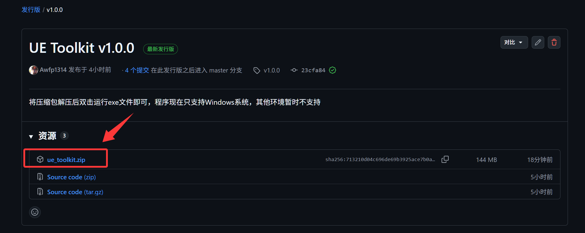

---

### 首次运行

直接双击 `ue_toolkit.exe` 运行程序

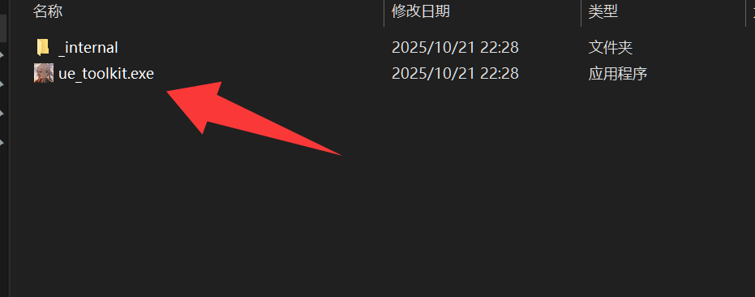

> ⚠️ **Windows 防护提示**
> 
> 首次运行时，Windows 可能会弹出"Windows 已保护你的电脑"的提示（因为程序为个人开发）
> 
> **解决方法：**
> 1. 点击 **"更多信息"** 按钮
> 2. 点击 **"仍要运行"**
> 3. 程序即可正常启动

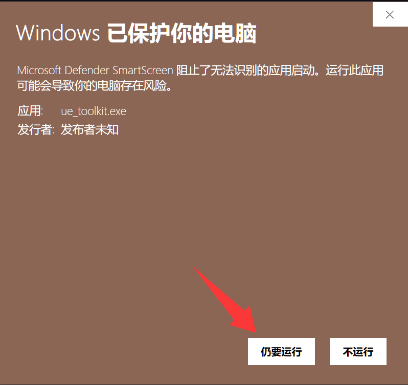

---

## 🚀 快速开始

### 首次启动配置

打开程序后，首次运行会弹出**路径配置对话框**，需要设置：

1. **资产库路径** - 存放所有资产的目录
2. **预览工程路径** - 用于预览资产的 UE 项目

设置好路径之后就可以使用所有功能了。

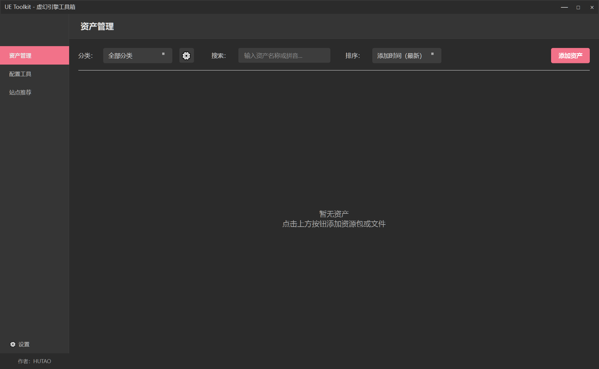

---

## 📚 详细功能指南

### 1️⃣ 添加资产

#### 两种添加方式

**方式一：使用"添加资产"按钮**
- 点击主界面的 **"➕ 添加资产"** 按钮
- 选择 "浏览资产" 或 "浏览资产包"

**方式二：拖拽导入**
- 直接将文件拖到内容窗口

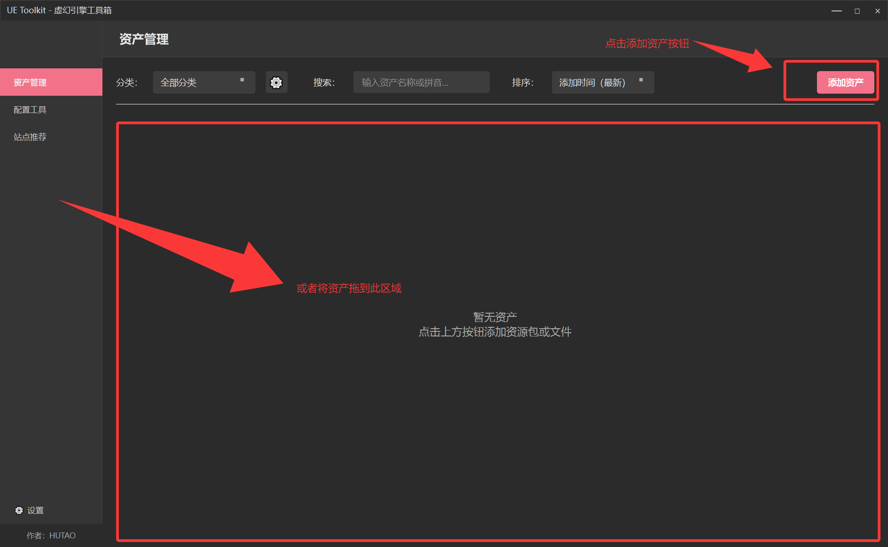

#### 📋 资产类型说明

点击浏览资产时，会让你选择资产包或者文件。一般在网上下载的资源有两种格式：

| 文件类型 | 选项 | 说明 |
|---------|------|------|
| **资产包** | 选择 "资源包" 选项 | 打包好的资源合集 |
| **单文件** | 选择 "资源文件" 选项 | fbx、uasset、obj 等单文件 |

> ⚠️ **重要提示**
> 
> 如果从网上下载的资产包是 `content/资产` 的格式：
> - ✅ **正确做法**：选择 `资产` 文件夹
> - ❌ **错误做法**：选择 `content` 文件夹
> 
> **务必选择 content 文件夹下的实际资产文件夹，不要包含 content 层级**

#### ⚙️ 自定义选项

添加资产时，可以自定义以下内容：

- **📝 资产名称** - 自定义显示的名称
- **🏷️ 分类** - 选择现有分类或创建新分类
  - 如果自行编辑的分类不存在，程序会自动创建新分类
- **📄 创建说明文档** - 勾选后可添加详细的使用说明
  - 完成添加后会弹出文档编辑窗口

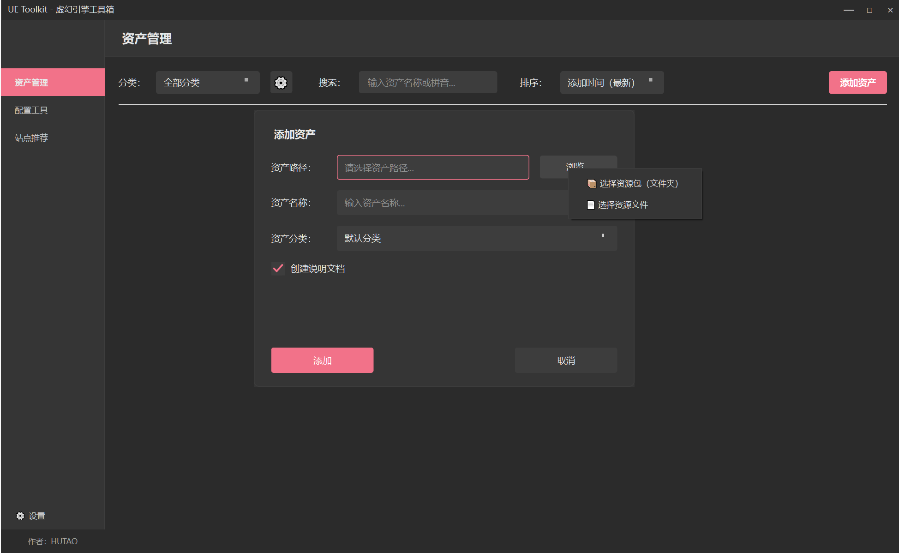

#### 🖼️ 缩略图管理

##### 自动生成缩略图

添加好资产后，刚开始是没有缩略图的。选择 **"🔍 预览资产"** 后：

1. 在虚幻引擎中打开资产
2. 调整视角到满意的角度
3. 使用引擎菜单：**截图** → **高分辨率截图**
4. 退出工程项目

✅ 缩略图会自动同步为你的高分辨率截图

> 💡 **提示**
> 
> 如果你没有进行**高分辨率截图**，每次退出引擎时，缩略图都会同步更新为当前的最后画面。这意味着缩略图是动态变化的，取决于你退出引擎时的视角。

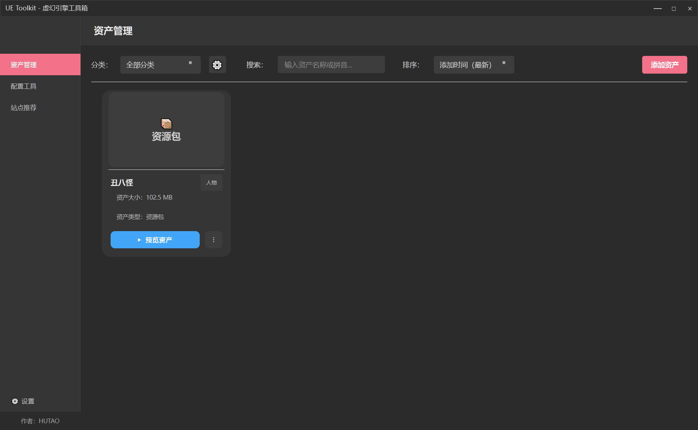

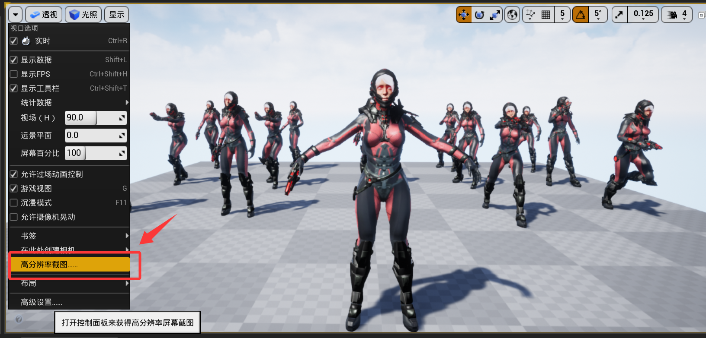

##### 更新缩略图

截完图后退出工程，可以看到缩略图已经自动同步了

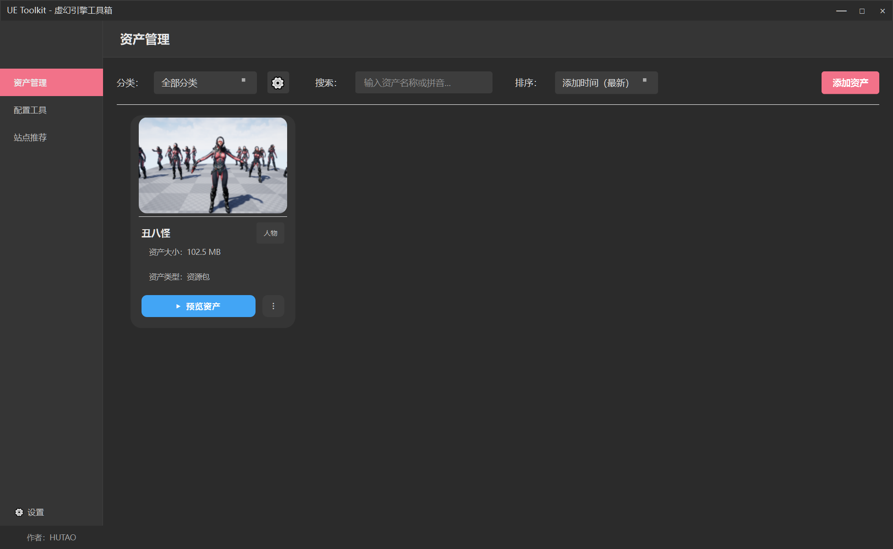

> 💡 如果想更改缩略图，只需在预览资产时重新截一张高分辨率截图即可

#### 🔍 内容浏览与管理

在资产库主界面，上方的工具栏提供了多种功能：

- **🔎 搜索** - 快速查找资产
- **📊 排序** - 按不同方式排序
- **🏷️ 分类管理** - 管理资产分类
- **⋮ 更多操作** - 点击资产卡片右下角的三个点

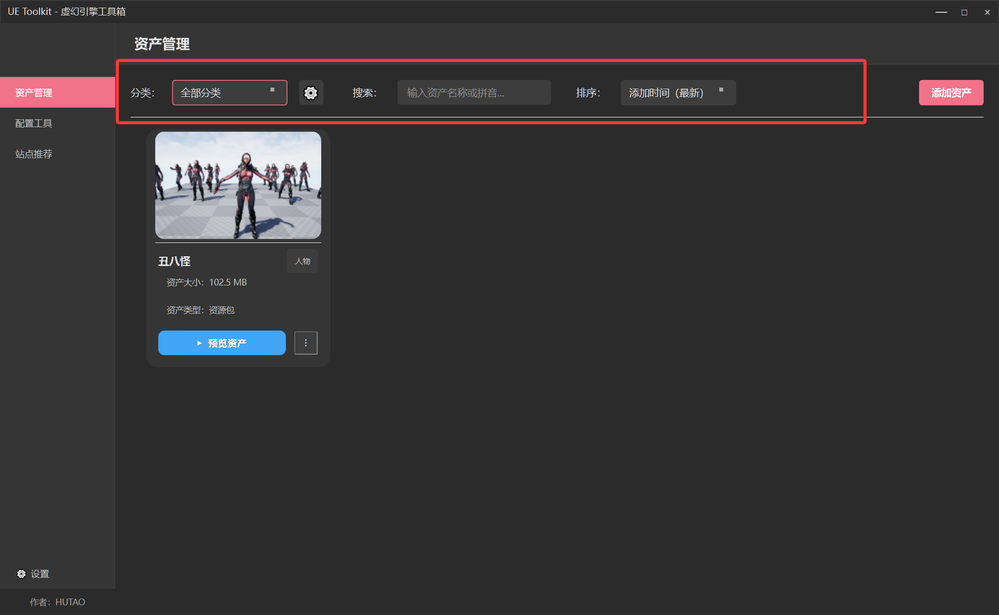

---

### 2️⃣ 在其他工程中使用资产

#### 📋 场景一：整个资产包都需要

如果你需要将整个资产包应用到另一个工程：

1. 找到要迁移的资产卡片
2. 点击卡片右下角的 **⋮** (三个点)
3. 选择 **"迁移到工程"**

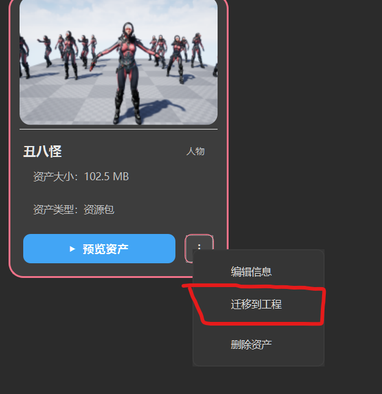

4. 在弹窗中选择想要应用到的工程

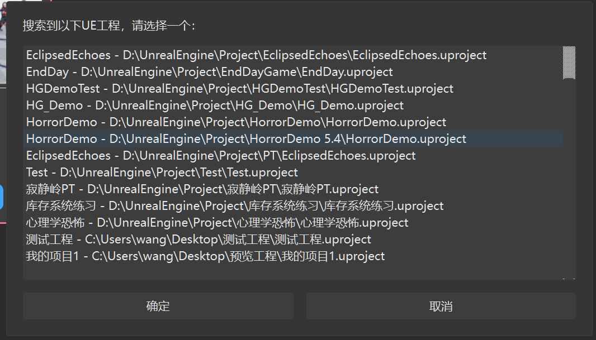

> 💡 如果当前有运行中的工程，会直接应用到当前正在运行的工程

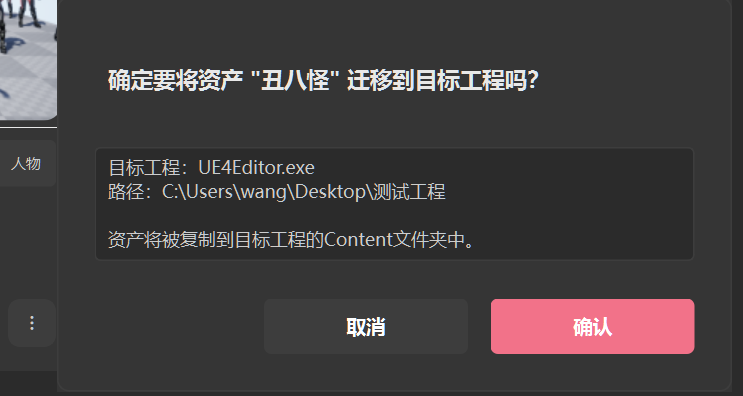

5. 点击确认后，资产会自动添加到目标工程

✅ **完成** - 打开目标工程即可看到资产已正确添加进来，资源也没有任何损坏

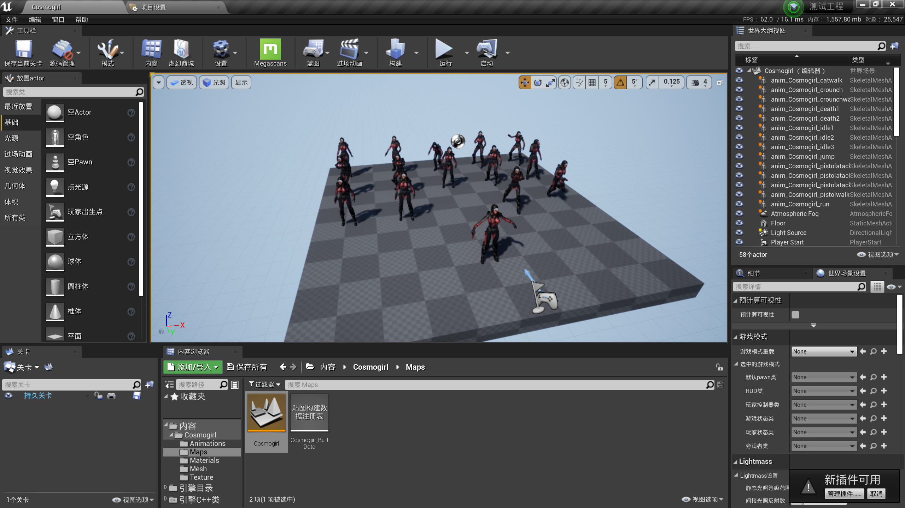

#### 📋 场景二：只需要资产包中的部分资产

如果资产包很大，但你只需要其中的几个资产，可以采用这种方式：

1. 选择 **"🔍 预览资产"** 打开资产包
2. 在虚幻引擎中浏览资产包内容
3. 在引擎中复制你需要的资产
4. 粘贴到目标工程

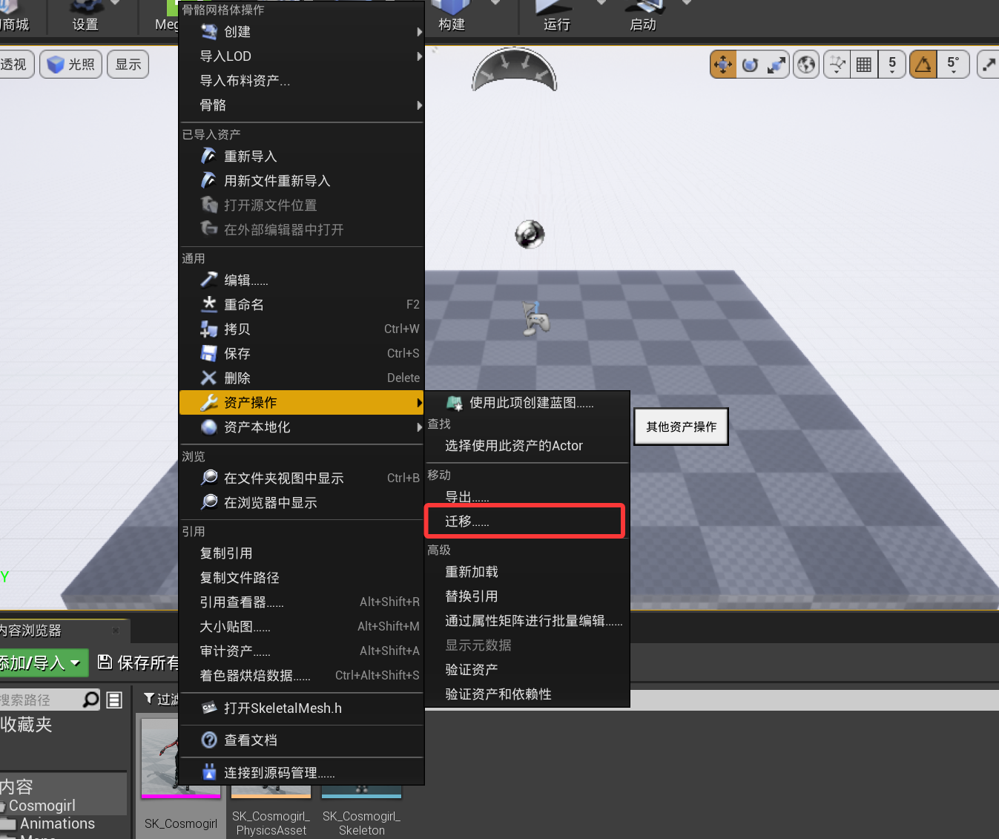

> 💡 这种方式更灵活，适合从大型资产包中挑选所需内容

---

### 3️⃣ 配置管理

#### 添加工程配置

在配置管理界面，点击 **"➕ 添加配置"**，会弹出工程选择界面：

1. 选择要添加配置的工程

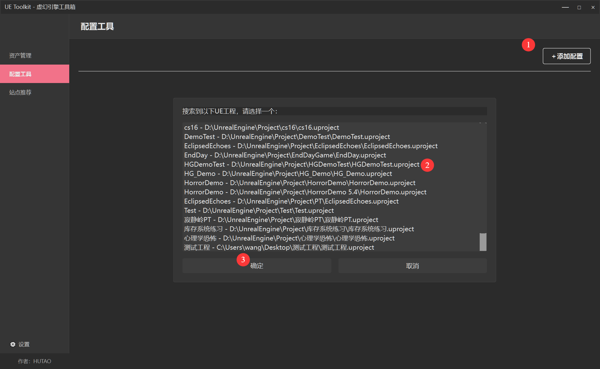

2. 选择要添加的配置项（可选择多个）

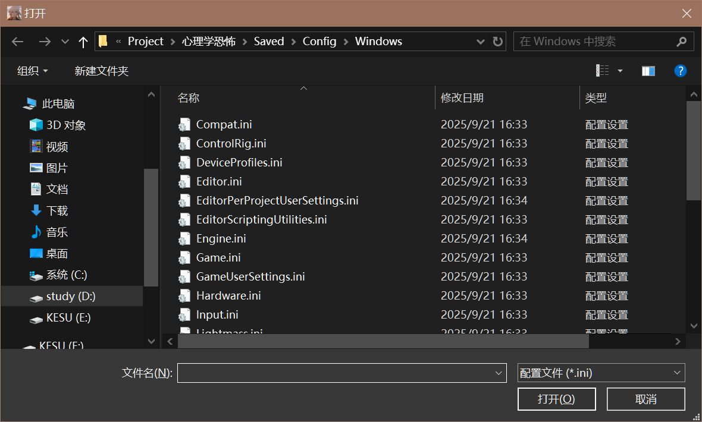

3. 设置配置名称

设置好配置名称后，添加的配置就会出现在内容界面了

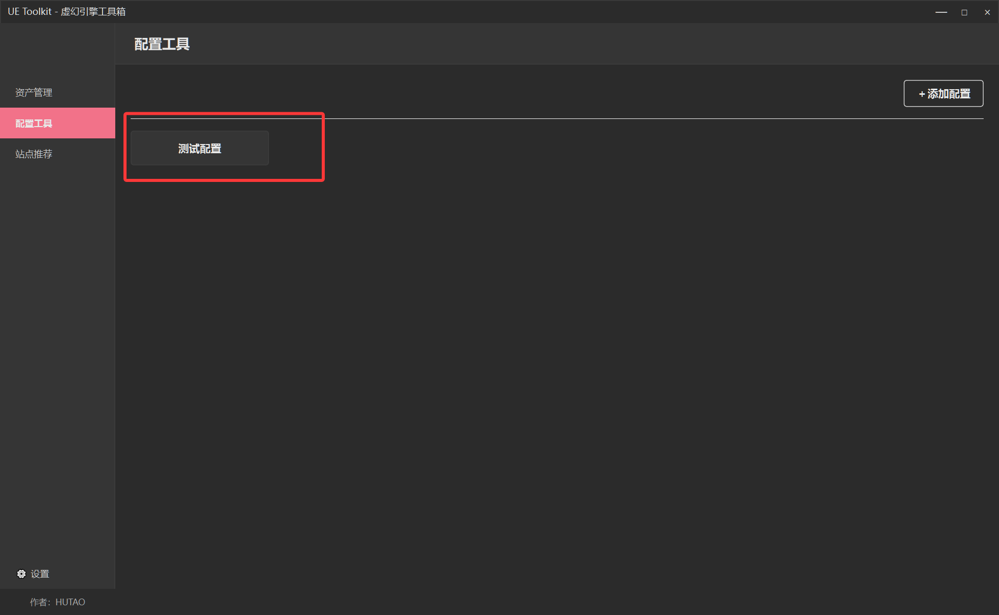

#### 应用配置到工程

使用方式很简单：

1. 在配置列表中点击要应用的配置
2. 系统会搜索到所有的工程
3. 选择要设置配置的工程即可

> ⚠️ **重要**
> 
> 工程处在运行状态时，配置不能应用。若要应用配置，需要先将工程关闭。

---

### 4️⃣ 主题设置

在设置中可以配置资产、预览资产路径和设置主题。

默认有 **深色主题** 和 **浅色主题**，用户还可以添加自定义主题到程序中。

---

## 🎨 主题自定义

### 主题文件格式

#### 基本结构

主题文件是一个 JSON 格式的文件，包含主题名称和颜色变量定义：

```json
{
  "name": "主题名称",
  "variables": {
    "颜色变量名": "颜色值",
    "另一个颜色变量": "颜色值"
  }
}
```

#### 示例参考

有关完整结构的示例，请参阅同目录下的 [example_custom_theme.json](resources/themes/example_custom_theme.json) 文件。

---

### 支持的主题变量

主题系统提供了一套完整的变量来控制应用程序的外观。这些变量分为几个逻辑组，每组都有明确的用途。

#### 背景色变量

用于创建界面的层次结构：

| 变量名         | 用途                       | 深色主题示例 | 浅色主题示例 |
| -------------- | -------------------------- | ------------ | ------------ |
| `bg_primary`   | 主体背景，整个窗口的大背景 | `#1e1e1e`    | `#ffffff`    |
| `bg_secondary` | 卡片和对话框的背景         | `#2b2b2b`    | `#f5f5f5`    |
| `bg_tertiary`  | 输入框和标签的背景         | `#353535`    | `#e0e0e0`    |
| `bg_hover`     | 鼠标悬停时的背景色         | `#3d3d3d`    | `#eeeeee`    |
| `bg_pressed`   | 鼠标按下时的背景色         | `#2a2a2a`    | `#e0e0e0`    |

**使用场景：**

- `bg_primary`：主窗口和侧边栏的大背景
- `bg_secondary`：资产卡片、对话框、设置面板
- `bg_tertiary`：文本输入框、下拉菜单、标签
- `bg_hover`：当鼠标悬停在菜单项或按钮上时
- `bg_pressed`：鼠标按下按钮的一瞬间

---

#### 文本色变量

用于确保文本的清晰可读性：

| 变量名           | 用途                         | 深色主题示例 | 浅色主题示例 |
| ---------------- | ---------------------------- | ------------ | ------------ |
| `text_primary`   | 重要的文字，如标题和按钮文字 | `#ffffff`    | `#212121`    |
| `text_secondary` | 次要信息，如文件路径和时间   | `#cccccc`    | `#616161`    |
| `text_tertiary`  | 提示信息，不太重要的说明     | `#aaaaaa`    | `#757575`    |
| `text_disabled`  | 禁用状态的文字               | `#666666`    | `#9e9e9e`    |

**实际应用：**

- `text_primary`：资产的名称、对话框的标题、按钮上的文字
- `text_secondary`：资产的分类、创建时间、具体的文件路径
- `text_tertiary`：各种提示和帮助信息
- `text_disabled`：灰掉的按钮、不能编辑的字段

---

#### 强调色变量

用于突出显示重要元素和交互状态：

| 变量名           | 含义                         | 默认值            |
| ---------------- | ---------------------------- | ----------------- |
| `accent`         | 主色，用于重要按钮和选中状态 | `#4CAF50`（绿色） |
| `accent_hover`   | 鼠标悬停时的颜色             | `#66BB6A`         |
| `accent_pressed` | 按下时的颜色                 | `#388E3C`         |

**使用场景：**

- `accent`：主要操作按钮（"确认"、"添加"、"保存"），以及选中元素的边框
- `accent_hover`：按钮被鼠标悬停时的样式
- `accent_pressed`：按钮被按下时的样式

---

#### 边框色变量

用于增强界面的结构感：

| 变量名         | 作用                      | 深色主题示例 | 浅色主题示例 |
| -------------- | ------------------------- | ------------ | ------------ |
| `border`       | 普通的分隔线和边框        | `#3d3d3d`    | `#e0e0e0`    |
| `border_hover` | 可点击元素被悬停时的边框  | `#4CAF50`    | `#4CAF50`    |
| `border_focus` | 输入框被激活/聚焦时的边框 | `#66BB6A`    | `#66BB6A`    |

**使用场景：**

- `border`：对话框的边框、面板之间的分隔线、输入框的默认边框
- `border_hover`：卡片或按钮被鼠标悬停时
- `border_focus`：输入框获得焦点、文本区域被激活

---

#### 状态色变量

用于传达应用程序的状态信息：

| 变量名    | 含义     | 默认值            | 用途                     |
| --------- | -------- | ----------------- | ------------------------ |
| `success` | 成功状态 | `#4CAF50`（绿色） | 操作成功、完成状态       |
| `warning` | 警告状态 | `#FF9800`（橙色） | 删除确认、需要注意的提示 |
| `error`   | 错误状态 | `#F44336`（红色） | 错误信息、删除按钮       |
| `info`    | 信息状态 | `#2196F3`（蓝色） | 预览按钮、信息对话框     |

---

#### 透明度变体

用于需要半透明效果的场景：

| 变量名               | 用途           | 深色主题示例             | 浅色主题示例                |
| -------------------- | -------------- | ------------------------ | --------------------------- |
| `bg_primary_alpha`   | 半透明的主背景 | `rgba(30, 30, 30, 0.85)` | `rgba(255, 255, 255, 0.95)` |
| `bg_secondary_alpha` | 半透明的次背景 | `rgba(43, 43, 43, 0.8)`  | `rgba(245, 245, 245, 0.9)`  |
| `accent_alpha`       | 半透明的强调色 | `rgba(76, 175, 80, 0.8)` | `rgba(76, 175, 80, 0.8)`    |

主要用于提示框、工具提示和背景遮罩等场景。

---

### 如何使用自定义主题

#### 方法一：通过 UI 导入（推荐）

1. 启动 UE Toolkit 应用程序
2. 点击左下角的 **"设置"** 按钮
3. 在 **"主题设置"** 区域点击 **"导入主题文件..."**
   - 选择准备好的 JSON 主题文件
   - 根据提示选择是否立即应用主题

#### 方法二：手动放置

1. 将主题 JSON 文件复制到 `resources/themes/` 目录
2. 在设置中通过 **"导入主题文件..."** 功能选择该文件
3. 应用程序会自动加载你的主题

#### 导出现有主题进行修改

如果你希望基于当前主题进行调整：

1. 在设置中点击 **"导出当前主题..."**
2. 选择保存位置和文件名
3. 使用文本编辑器打开导出的文件，修改颜色值
4. 重新导入修改后的文件

---

### 创建自定义主题

#### 步骤 1：准备模板

从现有示例开始是最简单的方法：

```bash
# 复制示例主题作为模板
cp example_custom_theme.json my_custom_theme.json
```

#### 步骤 2：编辑主题文件

使用文本编辑器打开 `my_custom_theme.json`：

```json
{
  "name": "my_custom_theme",
  "variables": {
    "bg_primary": "#替换为您喜欢的颜色",
    "bg_secondary": "#替换为您喜欢的颜色",
    ...
  }
}
```

**注意事项：**

- 必须包含全部 25 个变量，缺少任何一个都会导致加载失败
- 变量名必须完全匹配，区分大小写
- 支持的颜色格式包括：十六进制 `#1a1a2e`、RGB `rgb(26, 26, 46)`、RGBA `rgba(26, 26, 46, 0.85)`

#### 步骤 3：验证 JSON 格式

确保 JSON 格式正确：

- 使用在线工具验证：[JSONLint](https://jsonlint.com/)
- 或使用具有 JSON 验证功能的编辑器（如 VS Code）

#### 步骤 4：导入并测试

1. 在应用程序中导入主题文件
2. 全面测试界面效果：
   - 主窗口和侧边栏
   - 资产卡片（包括鼠标悬停效果）
   - 各类对话框
   - 按钮的各种状态
   - 输入框和下拉菜单
3. 如需调整，修改文件后重新导入

---

### 配色方案示例

以下是四个精心设计的配色方案示例，你可以直接使用或以此为基础创建自己的主题。

#### 深蓝红主题（现代科技风格）

适用于游戏开发工具的高科技感主题：

```json
{
  "name": "dark_blue_red",
  "variables": {
    "bg_primary": "#1a1a2e",
    "bg_secondary": "#16213e",
    "bg_tertiary": "#0f3460",
    "bg_hover": "#533483",
    "bg_pressed": "#1a1a2e",
    "text_primary": "#eaeaea",
    "text_secondary": "#c4c4c4",
    "text_tertiary": "#a0a0a0",
    "text_disabled": "#6b6b6b",
    "accent": "#e94560",
    "accent_hover": "#f27289",
    "accent_pressed": "#c7254e",
    "border": "#0f3460",
    "border_hover": "#e94560",
    "border_focus": "#f27289",
    "success": "#00d9ff",
    "warning": "#ffa500",
    "error": "#e94560",
    "info": "#00d9ff",
    "bg_primary_alpha": "rgba(26, 26, 46, 0.85)",
    "bg_secondary_alpha": "rgba(22, 33, 62, 0.8)",
    "accent_alpha": "rgba(233, 69, 96, 0.8)"
  }
}
```

**特点：** 深蓝色背景配合霓虹红色强调色，适合夜间工作环境。

---

#### 森林绿主题（自然护眼风格）

适合长时间工作的护眼主题：

```json
{
  "name": "forest_green",
  "variables": {
    "bg_primary": "#1e2a1a",
    "bg_secondary": "#2a3a26",
    "bg_tertiary": "#364a32",
    "bg_hover": "#425a3e",
    "bg_pressed": "#2a3a26",
    "text_primary": "#e8f5e9",
    "text_secondary": "#c8e6c9",
    "text_tertiary": "#a5d6a7",
    "text_disabled": "#66bb6a",
    "accent": "#4CAF50",
    "accent_hover": "#66BB6A",
    "accent_pressed": "#388E3C",
    "border": "#364a32",
    "border_hover": "#4CAF50",
    "border_focus": "#66BB6A",
    "success": "#66BB6A",
    "warning": "#FFB74D",
    "error": "#EF5350",
    "info": "#4FC3F7",
    "bg_primary_alpha": "rgba(30, 42, 26, 0.85)",
    "bg_secondary_alpha": "rgba(42, 58, 38, 0.8)",
    "accent_alpha": "rgba(76, 175, 80, 0.8)"
  }
}
```

**特点：** 深绿色系贯穿整个主题，有助于缓解眼部疲劳。

---

#### 紫罗兰主题（优雅神秘风格）

适合创意工作者的艺术气息主题：

```json
{
  "name": "violet",
  "variables": {
    "bg_primary": "#1a1a2e",
    "bg_secondary": "#2d1b4e",
    "bg_tertiary": "#3e2a5f",
    "bg_hover": "#4f3970",
    "bg_pressed": "#2d1b4e",
    "text_primary": "#f3e5f5",
    "text_secondary": "#e1bee7",
    "text_tertiary": "#ce93d8",
    "text_disabled": "#ab47bc",
    "accent": "#9c27b0",
    "accent_hover": "#ba68c8",
    "accent_pressed": "#7b1fa2",
    "border": "#3e2a5f",
    "border_hover": "#9c27b0",
    "border_focus": "#ba68c8",
    "success": "#66BB6A",
    "warning": "#FFA726",
    "error": "#EF5350",
    "info": "#42A5F5",
    "bg_primary_alpha": "rgba(26, 26, 46, 0.85)",
    "bg_secondary_alpha": "rgba(45, 27, 78, 0.8)",
    "accent_alpha": "rgba(156, 39, 176, 0.8)"
  }
}
```

**特点：** 神秘优雅的紫色系，能够激发创作灵感。

---

#### 日落橙主题（温暖活力风格）

充满能量感的温暖主题：

```json
{
  "name": "sunset_orange",
  "variables": {
    "bg_primary": "#2e1a1a",
    "bg_secondary": "#3e2626",
    "bg_tertiary": "#4e3232",
    "bg_hover": "#5e3e3e",
    "bg_pressed": "#3e2626",
    "text_primary": "#fff5f0",
    "text_secondary": "#ffe0cc",
    "text_tertiary": "#ffccaa",
    "text_disabled": "#cc9988",
    "accent": "#FF6F00",
    "accent_hover": "#FF8F00",
    "accent_pressed": "#E65100",
    "border": "#4e3232",
    "border_hover": "#FF6F00",
    "border_focus": "#FF8F00",
    "success": "#66BB6A",
    "warning": "#FFB74D",
    "error": "#EF5350",
    "info": "#42A5F5",
    "bg_primary_alpha": "rgba(46, 26, 26, 0.85)",
    "bg_secondary_alpha": "rgba(62, 38, 38, 0.8)",
    "accent_alpha": "rgba(255, 111, 0, 0.8)"
  }
}
```

**特点：** 暖色调设计，营造积极向上的工作氛围。

---

### 设计建议

#### 对比度要求

确保文本与背景之间有足够的对比度：

| 文本类型        | 最低对比度要求 | 推荐对比度 |
| --------------- | -------------- | ---------- |
| 大文本（18pt+） | 3:1            | 4.5:1      |
| 普通文本        | 4.5:1          | 7:1        |

推荐使用以下工具检查对比度：

- [WebAIM Contrast Checker](https://webaim.org/resources/contrastchecker/)
- [Coolors Contrast Checker](https://coolors.co/contrast-checker)

---

#### 配色设计原则

##### 1. 层次分明的背景色

深色主题应逐渐变亮，浅色主题应逐渐变暗：

- 深色主题: `#1e1e1e` → `#2b2b2b` → `#353535`（由暗到亮）
- 浅色主题: `#ffffff` → `#f5f5f5` → `#e0e0e0`（由亮到暗）

##### 2. 清晰的文本可读性

- `text_primary` 在 `bg_primary` 上必须清晰可见
- `text_secondary` 作为辅助信息可适当降低对比度
- `text_disabled` 应明确表示不可交互状态

##### 3. 醒目的强调色

- 应为整个主题中最突出的颜色
- 使用饱和度较高的颜色（绿、蓝、红等）
- 避免使用过暗或过浅的颜色

##### 4. 符合常规的状态色

遵循用户习惯的颜色语义：

- 🟢 绿色 = 成功
- 🟠 橙色 = 警告
- 🔴 红色 = 错误
- 🔵 蓝色 = 信息

##### 5. 整体协调性

保持主题色彩的统一性，避免混用不相关的色系。

---

#### 主题测试

完成主题设计后，请在以下场景中进行全面测试：

- 主窗口和侧边栏
- 资产卡片（包括鼠标悬停和选中状态）
- 所有类型的对话框
- 按钮的各种交互状态
- 输入框和下拉控件
- 各功能模块界面
- 设置界面

发现任何视觉问题应及时调整。

---

### 常见问题

#### 导入主题时提示"缺少必需的变量"？

确保主题文件包含了所有必需的变量。建议从 [example_custom_theme.json](resources/themes/example_custom_theme.json) 复制完整的变量列表，然后仅修改需要调整的颜色值。

---

#### 修改颜色后未生效？

请检查以下几点：

1. JSON 文件格式是否正确？可使用 [JSONLint](https://jsonlint.com/) 验证
2. 颜色格式是否支持？支持十六进制 `#fff`、RGB `rgb(255,255,255)`、RGBA `rgba(255,255,255,0.5)`
3. 变量名是否拼写正确？注意区分大小写
4. 是否已在设置界面点击"应用"？

---

#### 某些区域颜色显示异常？

通常为对比度问题：

1. 检查 `text_primary` 和 `bg_primary` 的对比度
2. 确保 `border` 颜色与背景色有明显区别
3. 使用对比度检测工具验证：https://webaim.org/resources/contrastchecker/

---

#### 如何恢复默认主题？

在设置界面的主题下拉框中选择 **"深色主题"** 或 **"浅色主题"** 即可恢复系统默认主题。

---

#### 可以同时使用多个自定义主题吗？

可以。每次导入新主题时，当前自定义主题会被覆盖。

**建议做法：**

- 为每个主题保存独立的 JSON 文件
- 使用有意义的文件名标识主题用途
- 需要切换时重新导入对应的主题文件

---

#### 主题配置会持久化保存吗？

是的。应用程序会自动保存当前使用的主题配置，下次启动时会自动加载上次使用的主题。

---

### 配色资源

寻找配色灵感时，可参考以下专业资源：

- [Coolors](https://coolors.co/) - 自动生成配色方案
- [Adobe Color](https://color.adobe.com/) - Adobe 官方配色工具
- [Material Design Colors](https://materialui.co/colors) - Google Material Design 色板
- [Paletton](https://paletton.com/) - 配色方案设计工具
- [Color Hunt](https://colorhunt.co/) - 社区分享的配色方案